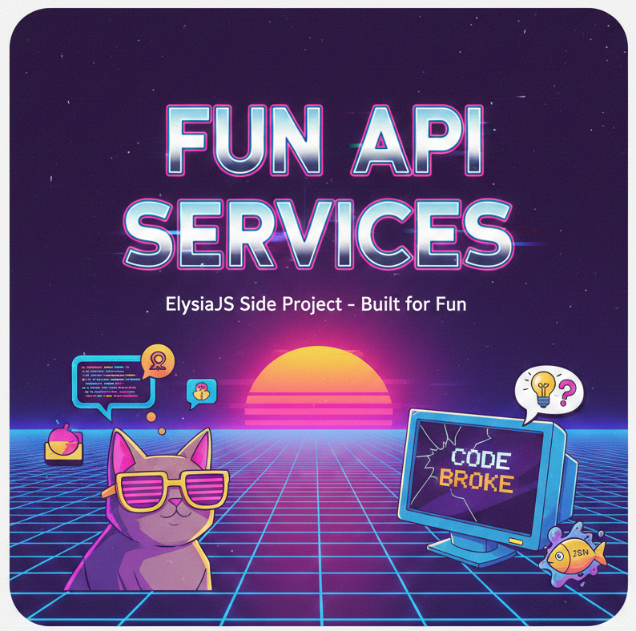

# Fun API Services

A collection of quirky API services built for fun (and to kill loneliness) as a side project using **ElysiaJS**.



## Currently Active Features

### Is it Friday?

A simple service to check if a specific date (or today) is the Friday you've been waiting for.

- **Endpoint:** `/is-friday`
- **Method:** `GET`
- **Query Parameters:**
  - `date`: (Optional) The date to check in string format (e.g., `2025-05-30`). Defaults to the current date if not provided.
- **Response:**
  - `true` – If it’s Friday.
  - `false` – If it’s not Friday.
- **Try It Now:**
  - [Check Today](https://rpi.tail2b2eb6.ts.net/fun-apis/is-friday/)
  - [Check Specific Date](https://rpi.tail2b2eb6.ts.net/fun-apis/is-friday/?date=2025-12-26)

### Devloper Excuses?

Randomly generate the perfect excuse for when your code breaks.

- **Endpoint:** `/dev-excuse`
- **Method:** `GET`
- **Query Parameters:**
  - `category`: (Optional) Default is random
- **Response:**

  ```json
  {
    "id": 1,
    "category": "quantum",
    "en": "Schrödinger's Bug: The code is both working and broken until you observe it.",
    "th": "บั๊กของชโรดิงเจอร์ครับ โค้ดมันทั้งรันได้และพังไปพร้อมๆ กัน จนกว่าพี่จะเปิดดู"
  }
  ```

- **Try It Now:**
  - [Random](https://rpi.tail2b2eb6.ts.net/fun-apis/dev-excuse/)
  - [Speicific Category](https://rpi.tail2b2eb6.ts.net/fun-apis/dev-excuse?category=general)

---

## Upcoming Ideas (Roadmap)

- [ ] 🐱 **Philosophurr**: Random cat photos paired with absurdly "high" philosophical quotes.
- [x] 💻 **Developer Excuses**: Randomly generate the perfect excuse for when your code breaks.
- [ ] 🐟 **JSON Fish Sauce**: A quirky tool to map your JSON keys into various fish sauce ingredients.

---

## Fun API Services (ภาษาไทย)

โปรเจกต์รวม API ขำ ๆ สร้างแก้เหงา (Side Project) ด้วย **ElysiaJS**

## Features ที่เปิดใช้งานแล้ว

### Is it Friday ?

บริการเช็คว่าวันที่คุณต้องการ (หรือวันนี้) คือวันศุกร์ที่รอคอยหรือไม่

- **Endpoint:** `/is-friday`
- **Method:** `GET`
- **Query Parameters:**
  - `date`: (Optional) วันที่ที่ต้องการตรวจสอบในรูปแบบ Date String (เช่น `2025-05-30`)
- **Response:**
  - `true` - ถ้าเป็นวันศุกร์
  - `false`- ถ้าไม่ใช่วันศุกร์
- **Try Now**:
  - [ดูวันนี้](https://rpi.tail2b2eb6.ts.net/fun-apis/is-friday/)
  - [ระบุวันที่](https://rpi.tail2b2eb6.ts.net/fun-apis/is-friday/?date=2025-12-26)

---

### Devloper Excuses?

สุ่มคำแก้ตัวฮา ๆ เวลาทำโค้ดพัง

- **Endpoint:** `/dev-excuse`
- **Method:** `GET`
- **Query Parameters:**
  - `category`: (Optional) หมวดหมู่ที่ต้องการ หากไม่ใส่จะสุ่มหมวดหมู่
- **Response:**

  ```json
  {
    "id": 1,
    "category": "quantum",
    "en": "Schrödinger's Bug: The code is both working and broken until you observe it.",
    "th": "บั๊กของชโรดิงเจอร์ครับ โค้ดมันทั้งรันได้และพังไปพร้อมๆ กัน จนกว่าพี่จะเปิดดู"
  }
  ```

- **Try It Now:**
  - [สุ่ม](https://rpi.tail2b2eb6.ts.net/fun-apis/dev-excuse/)
  - [ระบุหมวดหมู่](https://rpi.tail2b2eb6.ts.net/fun-apis/dev-excuse?category=general)

---

## Upcoming Ideas (Roadmap)

- [ ] 🐱 Philosophurr: สุ่มรูปแมวพร้อมคำคมกาว ๆ
- [x] 💻 Developer Excuses: สุ่มคำแก้ตัวเวลาทำ Code พัง
- [ ] 🐟 JSON Fish Source: เปลี่ยน Key ของ JSON ให้เป็นส่วนประกอบของน้ำปลา

---

## License

MIT
